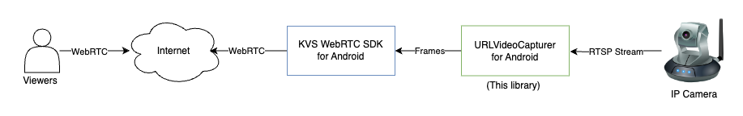

# URL Video Capturer for WebRTC

This folder contains an Android library project that implements a WebRTC VideoCapturer for video playback from a URL. You can use it just like any other VideoCapturer in WebRTC. For example, you can use this implementation along with [Amazon Kinesis Video Streams Android WebRTC SDK](https://github.com/awslabs/amazon-kinesis-video-streams-webrtc-sdk-android) in order to add video streams from an RTSP camera into the WebRTC session.

Here is an illustration of how the different components work together.

## License

This project is licensed under the Apache-2.0 License.

