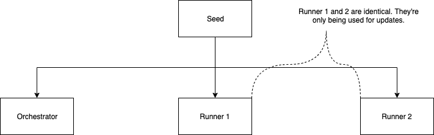
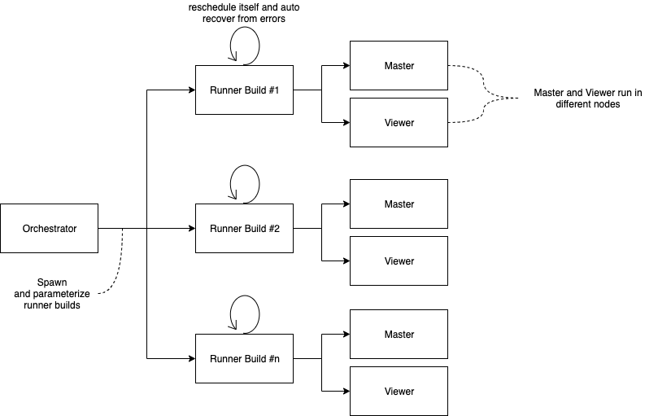
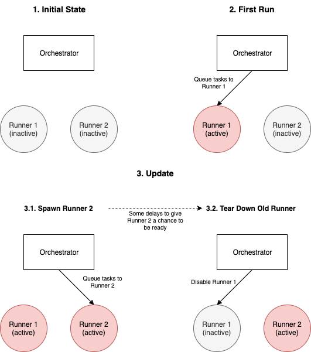

# WebRTC Canary

## Build

### Download
To download, run the following command:

`git clone https://github.com/aws-samples/amazon-kinesis-video-streams-demos.git`

You will also need to install `pkg-config` and `CMake` and a build environment

### Configure
Create a build directory in the newly checked out repository, and execute CMake from it.

`mkdir -p amazon-kinesis-video-streams-demos/canary/webrtc-c/build; cd amazon-kinesis-video-streams-demos/canary/webrtc-c/build; cmake .. `

### Build
To build the library and the provided samples, run make in the build directory you executed CMake.

`make`

### Run

```sh
./kvsWebrtcCanaryWebrtc [path/to/your/config.json]
```

JSON config example:

```json
{
  "AWS_KVS_LOG_LEVEL": 2,
  "CANARY_USE_TURN": true,
  "CANARY_TRICKLE_ICE": true,
  "CANARY_CLIENT_ID": "LoadTesting",
  "CANARY_IS_MASTER": false,
  "CANARY_CHANNEL_NAME": "ScaryTestChannel",
  "CANARY_LOG_GROUP_NAME": "canary"
}
```

## Using IoT credential provider

To use IoT credential provider to run canaries, navigate to the [scripts directory] (https://github.com/aws-samples/amazon-kinesis-video-streams-demos/tree/master/canary/webrtc-c/scripts). Run the following scripts:
1. To generate new IoT thing and credentials: `./generate-iot-credential.sh <thing-name-prefix>`
2. Set up certs by running: `./cert_setup.sh <thing-name-prefix>`
3. Set up IoT credential provider related environment variables by modifying `init.sh` for master and `v_init.sh` for viewer to first use IoT credential provider (set `CANARY_USE_IOT_PROVIDER` to `TRUE`) and run: `./init.sh <thing-name-prefix>` and `./v_init.sh <thing-name-prefix>` respectively.
4. Run the executable in the build directory by following the build and run instructions above.

## Cloudwatch Metrics

The default Cloudwatch namespace is **KinesisVideoSDKCanary**. Each metric listed below will be emitted twice, 
one with a label dimension and the other with label and channel dimensions. By omitting the channel dimension, 
metrics that come from different channel names by with the same label will be aggregated. This can be really 
useful for a scenario where we want to logically group metrics from different runs, e.g. we have a periodic 
start/stop scenario and we want to run this scenario with different sets of devices. While it's useful to 
aggregate these metrics, it's also equally important to keep metrics with the channel dimension to keep
the granular access to these metrics.

### Webrtc

| Category           | Metric                         | Unit              | Dimensions | Frequency (seconds) | Description                                                                                                                                                                     |
|--------------------|--------------------------------|-------------------|------------|---------------------|---------------------------------------------------------------------------------------------------------------------------------------------------------------------------------|
| Shutdown           | ExitStatus                     | Count             | Code       | -                   | Every time the Canary runs, it'll post exactly once. If successful, the code will be 0x00000000.                                                                                |
| Initialization     | SignalingInitDelay             | Milliseconds      | -          | -                   | Measure the time it takes for Signaling from creation to connected.                                                                                                             |
| Initialization     | ICEHolePunchingDelay           | Milliseconds      | -          | -                   | Measure the time it takes for ICE agent to successfully connect to the other peer.                                                                                              |
| End to End         | EndToEndFrameLatency           | Milliseconds      | -          | 30                  | The delay from sending the frame to when the frame is received on the other end                                                                                                 |
| End to End         | FrameSizeMatch                 | None              | -          | 30                  | The decoded canary data (header + frame data) at the receiver end is compared with the received size as part of header). If equal, 1.0 is pushed as a metric, else 0.0 is pushed |
| Outbound RTP Stats | FramesPerSecond                | Count_Second      | -          | 60                  | Measures the rate at which frames are sent out from the master. This is calculated using outboundRtpStats                                                                       |
| Outbound RTP Stats | PercentageFrameDiscarded       | Percent           | -          | 60                  | This expresses the percentage of frames that dropped on the sending path within a given time interval. This is calculated using outboundRtpStats                                |
| Outbound RTP Stats | PercentageFramesRetransmitted  | Percent           | -          | 60                  | This expresses the percentage of frames that are retransmitted on the sending path within a given time interval.  This is calculated using outboundRtpStats                     |
| Outbound RTP Stats | NackPerSecond                  | Count_Second      | -          | 60                  | Rate at which Nacks are received by master. This is calculated using outboundRtpStats                                                                                           |
| Inbound RTP Stats  | IncomingBitRate                | Kilobits_Second   | -          | 60                  | Measures the rate at which frame bits are received by master. This is calculated using inboundRtpStats                                                                          |
| Inbound RTP Stats  | IncomingPacketsPerSecond       | Count_Second      | -          | 60                  | Measures the rate at which packets are received by the master. This is calculated using inboundRtpStats                                                                         |
| Inbound RTP Stats  | IncomingFramesDroppedPerSecond | Count_Second      | -          | 60                  | Rate at which the incoming frames are dropped. This is calculated using inboundRtpStats                                                                                         |

### Signaling

| Category   | Metric                    | Unit          | Dimensions | Frequency (seconds) | Description                                                                                      |
|------------|---------------------------|---------------|------------|---------------------|--------------------------------------------------------------------------------------------------|
| Shutdown   | ExitStatus                | Count         | Code       | -                   | Every time the Canary runs, it'll post exactly once. If successful, the code will be 0x00000000. |
| End to End | SignalingRoundtripLatency | Milliseconds  | -          | 15                  | Measure the roundtrip latency from sending an offer to receive an answer                         |

### Profiling

| Category  | Metric                         | Unit          | Dimensions | Frequency (seconds) | Description                                                                                                                                                                    |
|-----------|--------------------------------|---------------|------------|---------------------|--------------------------------------------------------------------------------------------------------------------------------------------------------------------------------|
| Shutdown  | ExitStatus                     | Count         | Code       | -                   | Every time the Canary runs, it'll post exactly once. If successful, the code will be 0x00000000.                                                                               |
| Signaling | CreateCallTime                 | Milliseconds  | -          | -                   | Measures time taken to create channel                                                                                                                                          |
| Signaling | GetEndpointCallTime            | Milliseconds  | -          | -                   | Measures time taken to get data endpoint                                                                                                                                       |
| Signaling | GetTokenTime                   | Milliseconds  | -          | -                   | Measures time taken to get credentials (AKID or IoT)                                                                                                                           |
| Signaling | DescribeCallTime               | Milliseconds  | -          | -                   | Measures time taken to describe the channel                                                                                                                                    |
| Signaling | GetIceConfigCallTime           | Milliseconds  | -          | -                   | Measures time taken to retrieve ICE server config                                                                                                                              |
| Signaling | ConnectCallTime                | Milliseconds  | -          | -                   | Measures time taken to connect to the signaling channel                                                                                                                        |
| Signaling | CreateClientTotalTime          | Milliseconds  | -          | -                   | Measures time taken to retrieve AWS credentials to get started with making signaling calls                                                                                     |
| Signaling | FetchClientTotalTime           | Milliseconds  | -          | -                   | Measures time taken to describe, create channel (if applicable) followed by a describe to get the details, get endpoint and get ICE config                                     |
| Signaling | ConnectClientTotalTime         | Milliseconds  | -          | -                   | Measures time taken to connect to the signaling as master/viewer                                                                                                               |
| Signaling | OfferToAnswerTime              | Milliseconds  | -          | -                   | Measures time taken to send out an answer once the offer is received.                                                                                                          |
| ICE       | LocalCandidateGatheringTime    | Milliseconds  | -          | -                   | Measures time taken to gather candidate from local interfaces                                                                                                                  |
| ICE       | HostCandidateSetUpTime         | Milliseconds  | -          | -                   | Measures time taken to create socket connections for local candidates and also creates candidate pairs with the available remote candidates                                    |
| ICE       | SrflxCandidateSetUpTime        | Milliseconds  | -          | -                   | Measures time taken to create socket connections for srflx candidates. Candidate pair formation is done periodically in a timer callback as and when relay address is obtained |
| ICE       | RelayCandidateSetUpTime        | Milliseconds  | -          | -                   | Measures time taken to create socket connections for relay candidates. Candidate pair formation is done periodically in a timer callback as and when relay address is obtained |
| ICE       | IceServerResolutionTime        | Milliseconds  | -          | -                   | Measures time taken to DNS resolve ICE URLs                                                                                                                                    |
| ICE       | IceCandidatePairNominationTime | Milliseconds  | -          | -                   | Measures time taken to complete nomination of ICE candidate pair                                                                                                               |
| ICE       | IcecandidateGatheringTime      | Milliseconds  | -          | -                   | Measures time taken from starting gathering to when candidate gathering is done i.e when connectivity checks for all the pairs have been sent out or gathering times out.      |
| ICE       | IceAgentSetUpTime              | Milliseconds  | -          | -                   | Measures time taken to complete connectivity checks                                                                                                                            |
| Peer      | PcCreationTime                 | Milliseconds  | -          | -                   | Measures time taken to create peer connection object after receiving offer                                                                                                     |
| Peer      | DtlsSetupTime                  | Milliseconds  | -          | -                   | Measures time taken to complete DTLS initialization process                                                                                                                    |
| Peer      | ICEHolePunchingDelay           | Milliseconds  | -          | -                   | Measures time taken from start of connectivity checks to when the candidate pair is nominated and peer connection established                                                  |
| Total     | TimeToFirstFrame               | Milliseconds  | -          | -                   | Measures time taken from offer to sending out first frame                                                                                                                      |

## Jenkins

### Prerequisites

Required Jenkins plugins:
* [Job DSL](https://plugins.jenkins.io/job-dsl/)
* [Blue Ocean](https://plugins.jenkins.io/blueocean/)
* [CloudBees AWS Credentials](https://plugins.jenkins.io/aws-credentials/)
* [Throttle Concurrents](https://plugins.jenkins.io/throttle-concurrents/)

Required Credentials:
* CANARY_CREDENTIALS: AWS Credentials

Required Script Signature Approvals:
* method hudson.model.ItemGroup getAllItems java.lang.Class
* method hudson.model.Job getBuilds
* method hudson.model.Job getLastBuild
* method hudson.model.Job isBuilding
* method hudson.model.Run getTimeInMillis
* method hudson.model.Run isBuilding
* method jenkins.model.Jenkins getItemByFullName java.lang.String
* method jenkins.model.ParameterizedJobMixIn$ParameterizedJob isDisabled
* method jenkins.model.ParameterizedJobMixIn$ParameterizedJob setDisabled boolean
* method org.jenkinsci.plugins.workflow.job.WorkflowRun doKill
* staticMethod jenkins.model.Jenkins getInstance
* staticField java.lang.Long MAX_VALUE

Create Nodes with the following labels:

TODO

### Architecture

#### Seeding

Seeding is a meta job whose sole job is to bootstrap other jobs, orchestrators, and runners. 
When there's a new change to the seed or the other jobs that were created from the seed, the change will automatically propagate to the other jobs. 

The concept is very similar to [AWS CloudFormation](https://aws.amazon.com/cloudformation/)




#### Orchestration

Orchestration is a process of permuting a set of the canary configuration and delegate the works to the runner. The permutation can range from streaming duration, bitrate, device types, regions, etc.




#### Update Flow

Finally, our canary is up and running. But, now, we want to make changes to the canary or update the SDK version without shutting down the whole canary.

To achieve this, the update process uses the rolling update technique:


