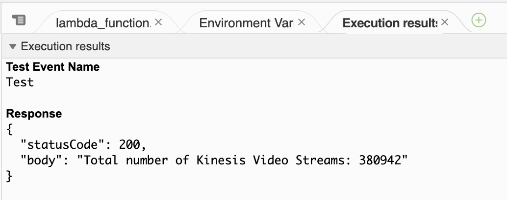

# Kinesis Video Streams Counter Lambda Function

This AWS Lambda function fetches the total number of Kinesis Video Streams within a specified AWS region using the AWS SDK for Python (Boto3). It employs a retry mechanism for handling transient errors and provides error handling for potential exceptions.

## Functionality

The Lambda function performs the following tasks:

1. Connects to the Kinesis Video Streams service in the specified AWS region.
2. Retrieves the list of Kinesis Video Streams using the `list_streams` API.
3. Iterates through the paginated responses to count the total number of streams.
4. Provides retry logic for transient errors such as throttling or service limits.
5. Returns the total count of Kinesis Video Streams.

## Usage

To deploy and use this Lambda function using the AWS Management Console:

1. Navigate to the [Lambda functions page](https://console.aws.amazon.com/lambda/home#/functions).
2. Choose **Create function**.
3. Select **Author from scratch**. 
4. In the **Basic information** pane, for **Function name** enter **FetchStreamCount**.
5. For Runtime, choose **Python 3.10**.
6. Leave architecture set to **x86_64**.
7. Choose an IAM role for this function. It must have `kinesisvideo:ListStreams` permission. Create one if necessary.
8. Choose **Create function**.
9. Switch to the **Configuration** tab and increase the **Timeout**. Adjust the timeout based on your maximum stream count quota.
10. Switch back to the **Code** tab and paste the contents of `list_streams_lambda.py` into the `lambda_function.py` file.
11. Choose **Deploy**.
12. Choose **Test**.
13. Leave the configurations unchanged. Choose **Invoke**.
14. The stream count will be fetched and the run logs will be shown.



### What's next?

15. Set up event triggers to periodically invoke the function to retrieve the total count of Kinesis Video Streams. You can also send the stream count metrics to CloudWatch for monitoring.

## Dependencies

This Lambda function relies on the following dependencies:

- `boto3`: AWS SDK for Python.
- `botocore`: Library for handling exceptions and low-level API interactions in Boto3.

In the Lambda environment, these are already present.

If you are using the `list_streams.py` on your local environment, follow the [boto3 installation instructions](https://boto3.amazonaws.com/v1/documentation/api/latest/guide/quickstart.html):
```shell
pip install boto3
```

## Error Handling

The function handles various error scenarios gracefully:

- **Client Errors:** Logs error details and retries for certain exceptions specified in `retryable_exceptions`.
- **Non-retryable Errors:** Raises the exception for non-retryable errors, such as a missing permission error (AccessDeniedException).

## Notes

- Ensure that the Lambda function's execution role has sufficient permissions to access Kinesis Video Streams (specifically, the `kinesisvideo:ListStreams` permission).
- The limit for the [ListStreams API](https://docs.aws.amazon.com/kinesisvideostreams/latest/dg/API_ListStreams.html) can be found on the [Kinesis Video Streams Limits](https://docs.aws.amazon.com/kinesisvideostreams/latest/dg/limits.html) page.

## License

This Lambda function is released under the [Apache 2.0 License](../../LICENSE).
