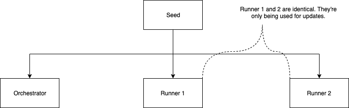

# WebRTC Canary

## Build

### Download
To download run the following command:

`git clone https://github.com/aws-samples/amazon-kinesis-video-streams-demos.git`

You will also need to install `pkg-config` and `CMake` and a build enviroment

### Configure
Create a build directory in the newly checked out repository, and execute CMake from it.

`mkdir -p amazon-kinesis-video-streams-demos/build; cd amazon-kinesis-video-streams-demo/build; cmake .. `

### Build
To build the library and the provided samples run make in the build directory you executed CMake.

`make`

### Run

```sh
./kvsWebrtcCanaryWebrtc [path/to/your/config.json]
```

JSON config example:

```json
{
  "AWS_KVS_LOG_LEVEL": 2,
  "CANARY_USE_TURN": true,
  "CANARY_TRICKLE_ICE": true,
  "CANARY_CLIENT_ID": "LoadTesting",
  "CANARY_IS_MASTER": false,
  "CANARY_CHANNEL_NAME": "ScaryTestChannel",
  "CANARY_LOG_GROUP_NAME": "canary"
}
```

## Jenkins

### Prerequisites

Required Jenkins plugins:
* [Job DSL](https://plugins.jenkins.io/job-dsl/)
* [Blue Ocean](https://plugins.jenkins.io/blueocean/)
* [CloudBees AWS Credentials](https://plugins.jenkins.io/aws-credentials/)
* [Throttle Concurrents](https://plugins.jenkins.io/throttle-concurrents/)

Required Credentials:
* CANARY_CREDENTIALS: AWS Credentials

Required Script Signature Approvals:
* method hudson.model.ItemGroup getAllItems java.lang.Class
* method hudson.model.Job getBuilds
* method hudson.model.Job isBuilding
* method hudson.model.Run isBuilding
* method jenkins.model.Jenkins getItemByFullName java.lang.String
* method jenkins.model.ParameterizedJobMixIn$ParameterizedJob isDisabled
* method jenkins.model.ParameterizedJobMixIn$ParameterizedJob setDisabled boolean
* method org.jenkinsci.plugins.workflow.job.WorkflowRun doKill
* staticMethod jenkins.model.Jenkins getInstance

Create Nodes with the following labels:

TODO

### Architecture

#### Seeding

Seeding is a meta job that its sole job is to bootstrap other jobs, orchestrator and runners. 
When there's a new change to the seed or the other jobs that were created from the seed, the change will automatically propagate to the other jobs. 

The concept is very similar to [AWS CloudFormation](https://aws.amazon.com/cloudformation/)




#### Orchestration

Orchestration is a process of permuting a set of the canary configuration and delegate the works to the runner. The permutation can be ranging from streaming duration, bitrate, device types, regions, etc.


#### Update Flow

Finally, our canary is up and running. But, now, we want to make changes to the canary or update the SDK version without shutting down the whole canary.

To achieve this, the update process uses the rolling update technique:


