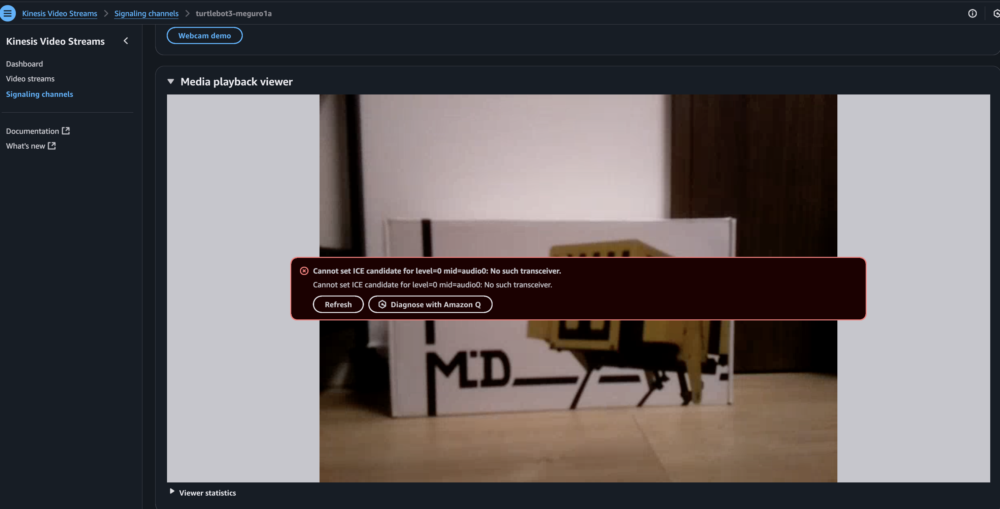
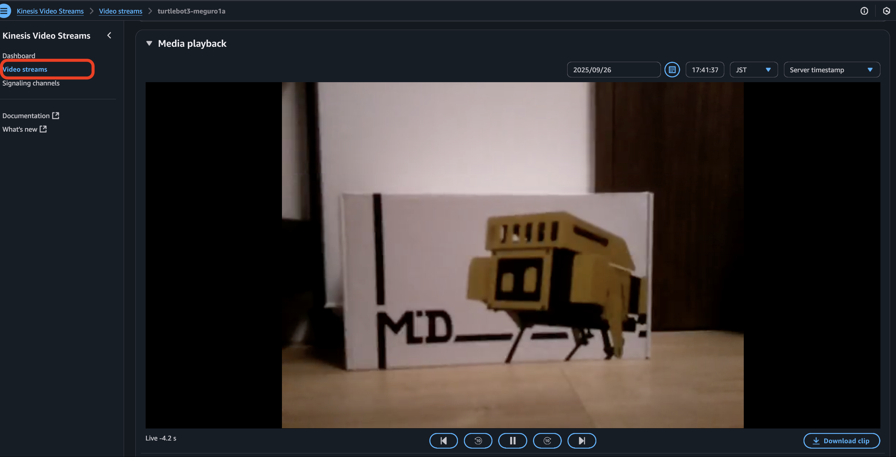
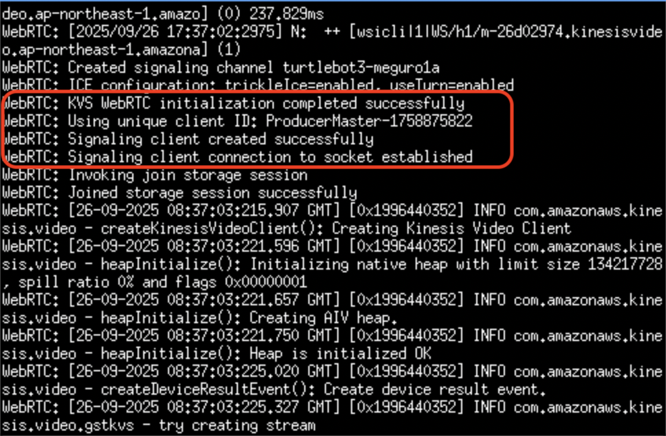
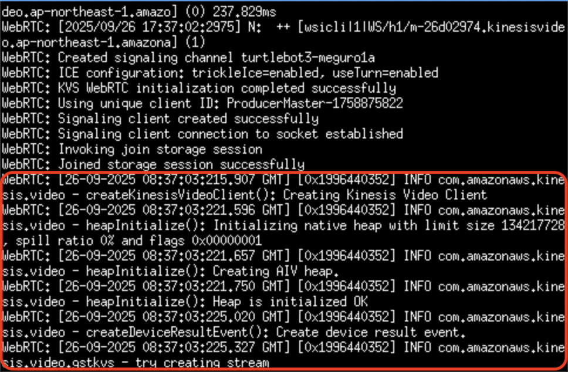
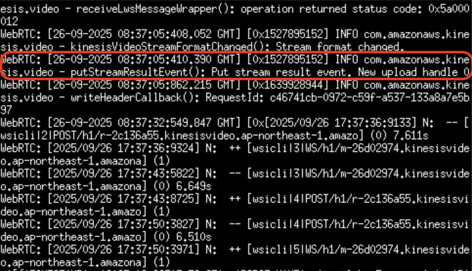

# KVS WebRTC and Direct Stream Simultaneously
## Overview

Added a gstreamer app sample (`kvsWebRTCAndDirectStream.c`) to support streaming video to KVS with WebRTC SDK (for real-time use) and Stream Producer SDK (for video ingestion), simultaneously from 1 camera source.

This sample is currently only tested on Raspberry Pi 3B equipped with USB Camera. 

## Prerequisites

- AWS Account with configured:
  - Kinesis Video Streams
  - IAM role with appropriate permissions
- **Physical webcam required**: The application uses `autovideosrc` and will not fallback to `videotestsrc` if no camera is connected

## Installation and Configuration

1. Clone this repository to your Raspberry Pi with submodules:
   ```
   git clone --recurse-submodules https://github.com/aws-samples/amazon-kinesis-video-streams-demos.git
   ```
   
   Or if already cloned, initialize submodules:
   ```
   git submodule update --init --recursive
   ```

2. Copy the sample file to the WebRTC SDK samples directory:
   ```
   cp kvsWebRTCAndDirectStream.c amazon-kinesis-video-streams-webrtc-sdk-c/samples/
   ```

3. Configure your AWS credentials on the Raspberry Pi

### Building the AWS SDKs

Refer to each SDK main repository for the details of how to build. `-DALIGNED_MEMORY_MODEL=ON` flag might need to be used on Raspberry Pi 4B and 5B.

- https://github.com/awslabs/amazon-kinesis-video-streams-webrtc-sdk-c
- https://github.com/awslabs/amazon-kinesis-video-streams-producer-sdk-cpp

#### Building the KVS Producer SDK

```
cd amazon-kinesis-video-streams-producer-sdk-cpp
mkdir -p build
cd build
cmake .. -DBUILD_DEPENDENCIES=OFF
make -j
```

#### Building the KVS WebRTC SDK

```
cd amazon-kinesis-video-streams-webrtc-sdk-c
mkdir -p build
cd build
cmake .. -DBUILD_DEPENDENCIES=OFF
make -j
```

## Usage

1. Configure your AWS credentials on the Raspberry Pi

2. Configure GStreamer plugin path with the path where you build the KVS Streams Producer app, e.g., `export GST_PLUGIN_PATH=/home/pi/amazon-kinesis-video-streams-producer-sdk-cpp/build`

3. Go to `amazon-kinesis-video-streams-webrtc-sdk-c/build/` and run `./samples/kvsWebRTCAndDirectStream <signaling channel name> <kvs stream name>`

## Screenshots

The following screenshots demonstrate WebRTC and Stream Producer running simultaneously:

### WebRTC Signaling Channel Viewer

*Real-time WebRTC streaming through the signaling channel*

### KVS Stream Viewer

*Near real-time video ingestion to Kinesis Video Stream*

### Application Logs

#### WebRTC Logs

*WebRTC connection and streaming logs*

#### KVS Stream Logs


*Kinesis Video Stream ingestion logs showing successful simultaneous operation*

## License

This project uses components from AWS Kinesis Video Streams SDKs which are licensed under the Apache License 2.0.