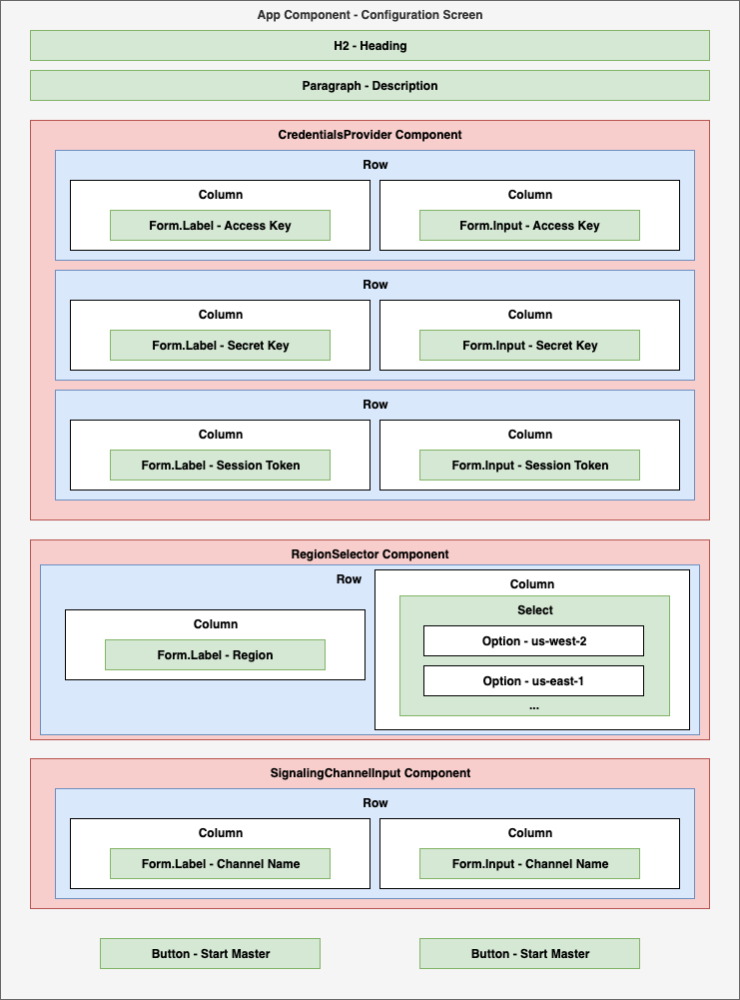
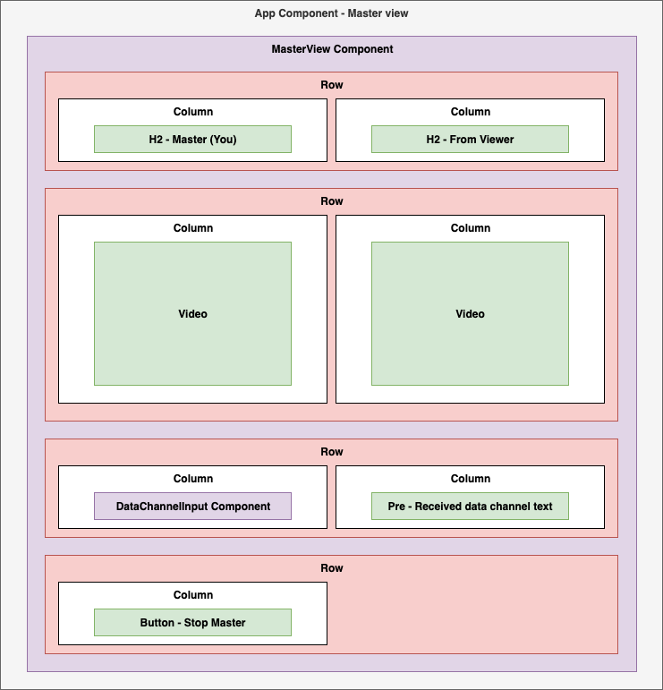
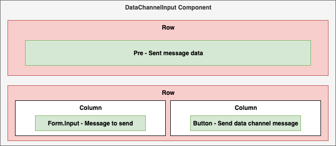

## Amazon Kinesis Video Streams WebRTC SDK in JS - Sample React implementation

This very minimal sample shows how to use the Amazon Kinesis Video Streams WebRTC
SDK in JS in the [**React framework**](https://react.dev/).

## Getting started

1. Clone the project.

```shell
git clone https://github.com/awslabs/amazon-kinesis-video-streams-webrtc-sdk-js.git
```

2. Change directories to the one containing the `package.json`.
```shell
cd amazon-kinesis-video-streams-demos/webrtc-js
```

3. Install:

```shell
npm install
```

4. Start the React server. A browser window should open automatically (http://localhost:3000).

```shell
npm start
```


5. Fill in the fields and choose "Start Master" or "Start Viewer". The buttons will be enabled once the fields 
are filled in. You can test this with the other JS sample page as well: https://awslabs.github.io/amazon-kinesis-video-streams-webrtc-sdk-js/examples/index.html


------

## App Layout

The App component has 3 different states it can be in: Configuration state, Master state, and Viewer state.

### Configuration state



### Master state



### Viewer state


### Data channel component


